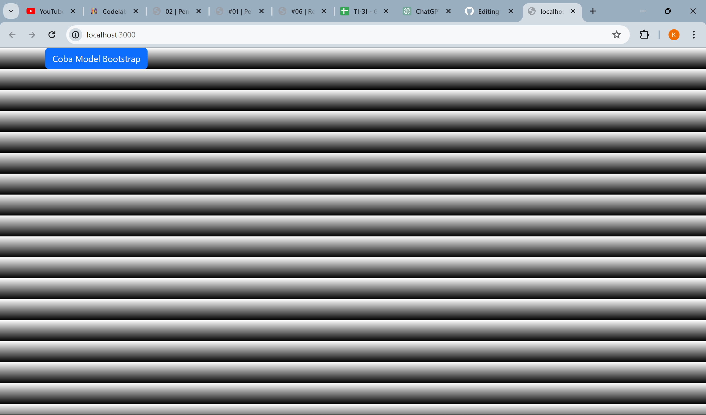
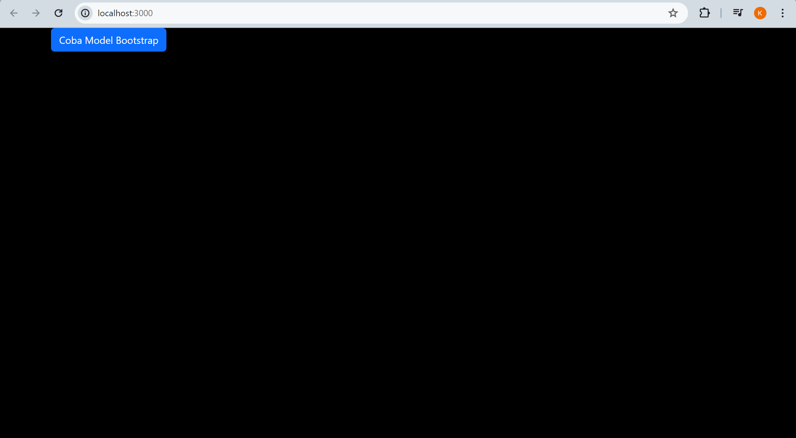
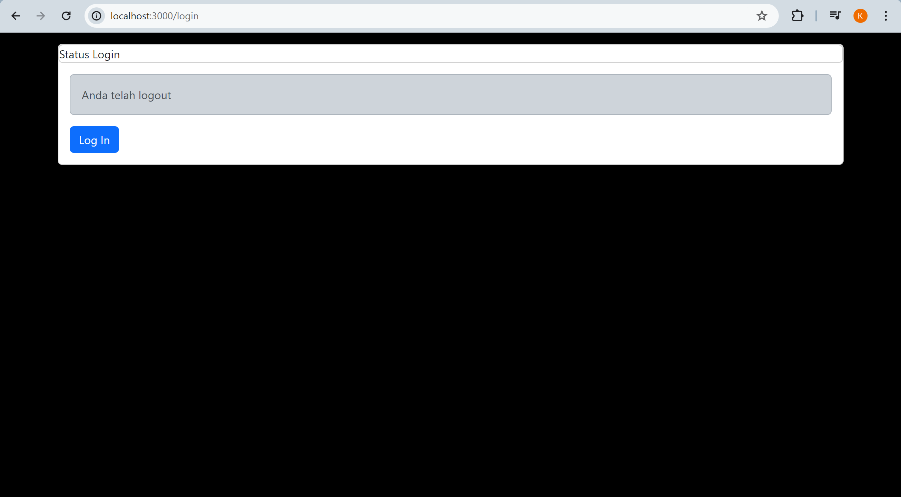
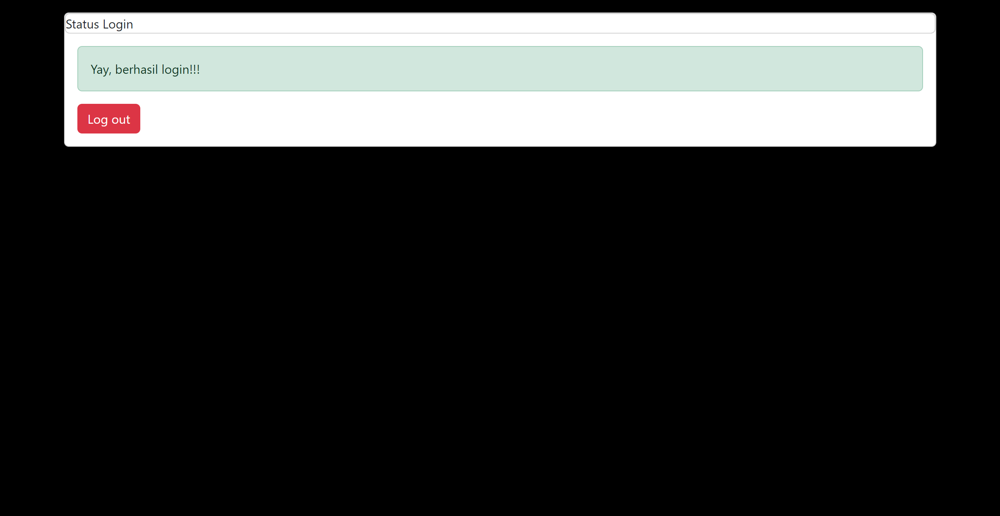
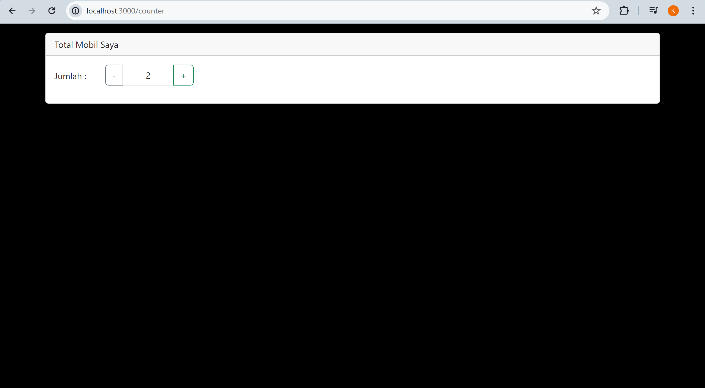

This is a [Next.js](https://nextjs.org/) project bootstrapped with [`create-next-app`](https://github.com/vercel/next.js/tree/canary/packages/create-next-app).

## Getting Started

First, run the development server:

```bash
npm run dev
# or
yarn dev
# or
pnpm dev
# or
bun dev
```

Open [http://localhost:3000](http://localhost:3000) with your browser to see the result.

You can start editing the page by modifying `pages/index.tsx`. The page auto-updates as you edit the file.

[API routes](https://nextjs.org/docs/api-routes/introduction) can be accessed on [http://localhost:3000/api/hello](http://localhost:3000/api/hello). This endpoint can be edited in `pages/api/hello.ts`.

The `pages/api` directory is mapped to `/api/*`. Files in this directory are treated as [API routes](https://nextjs.org/docs/api-routes/introduction) instead of React pages.

This project uses [`next/font`](https://nextjs.org/docs/basic-features/font-optimization) to automatically optimize and load Inter, a custom Google Font.
## Laporan Praktikum

|  | Pemrograman Berbasis Framework 2024 |
|--|--|
| NIM |  2141720152|
| Nama |  Khafillah Akbar Syahputra |
| Kelas | TI - 3I |


### Jawaban Praktikum 1


Setelah merubah -app.tsx :



### Jawaban Praktikum 2


SOAL

 Baris 25 dan 30 terdapat method parse(), apa yang terjadi jika kita tidak menggunakan method tersebut?
- Kita tidak  dapat mengekstrak atau memanipulasi isinya secara programatik. 

### Jawaban Praktikum 3



Tugas (Pertanyaan Praktikum)
Berdasarkan pada praktikum sebelumnya yang telah dilakukan, beberapa pertanyaan terkait praktikum perlu diselesaikan yaitu sebagai berikut.

1. Apa kegunaan dari kode ini import { useEffect } from "react"; Pada file pages/_app.tsx? jelaskan
-  Kode tersebut digunakan untuk mengimport use effect library. Di kode tersebut use effect digunakan untuk mengatur efek komponen react seperti menjalankan kode setelah dirender. Juga digunakan untuk memastikan script bootstrap hanya dimuat sekali.
2. Jika pada file pages/_app.tsx kita tidak menggunakan useEffect (menghapus baris 3, dan baris 9-11, apa yang akan terjadi?)
- script Bootstrap tidak akan dimuat secara dinamis setelah komponen _app.tsx dirender.
3. Mengapa di react/nextjs penulisan tag html untuk class, harus diganti menjadi className ?
-JavaScript memiliki kata kunci class yang digunakan untuk mendefinisikan kelas dalam kode JavaScript. Karena JSX (JavaScript XML) digunakan dalam React dan Next.js untuk menuliskan markup HTML dalam JavaScript, maka menggunakan class sebagai atribut pada elemen JSX dapat menimbulkan konflik dengan kata kunci JavaScript class.
4. Apakah store pada nextjs bisa menyimpan banyak redux reducer?
-Bisa, dalam Next.js store Redux yang dibuat dengan bisa menyimpan banyak reducer. 
5. Jelaskan kegunaan dari file store.js!
- a. Menggabungkan Reducer
- b. Membuat Redux Store
- c. Membuat Persistor
6. Pada file pages/login.tsx, apa maksud dari kode ini ?
 const { isLogin } = useSelector((state) => state.auth);
- useSelector digunakan untuk mendapatkan value dari slice auth dalam state Redux. Slice ini kemungkinan berisi informasi tentang status login pengguna. isLogin kemungkinan berisi nilai yang menunjukkan apakah pengguna sudah login atau belum.
7. Pada file pages/counter.tsx, apa maksud dari kode ini?
const {totalCounter} = useSelector((state) => state.counter);
- Dengan menggunakan useSelector, komponen  dapat mengakses nilai totalCounter yang ada di dalam state Redux dan menampilkan nilainya di dalam komponen tersebut. Pada kode ini nilai totalCounter  menunjukkan jumlah mobil yang dimiliki oleh pengguna, dan komponen ini memberikan interface untuk menambah atau mengurangi jumlah mobil tersebut dengan tombol "+" dan "-" yang ada di dalamnya.
